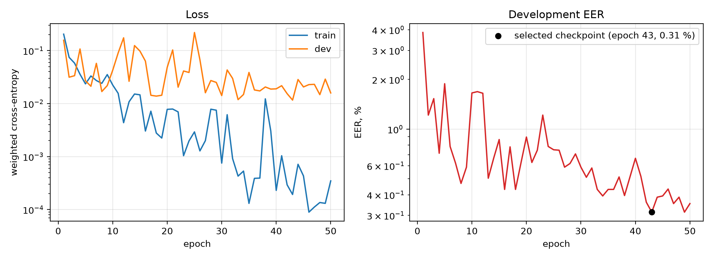

# Voice Anti-Spoofing

## О проекте

Система обнаружения синтезированной речи (Countermeasure, CM), обученная и измеренная на разделе Logical Access (LA) датасета [ASVSpoof 2019 Dataset](https://datashare.ed.ac.uk/handle/10283/3336) ([Kaggle Link](https://www.kaggle.com/datasets/awsaf49/asvpoof-2019-dataset)). 


Проект использует шаблон [PyTorch Project Template](https://github.com/Blinorot/pytorch_project_template)

---

## Установка и запуск

1. Создайте и активируйте окружение.

   Через `conda`:

   ```bash
	# create env
	conda create -n project_env python=PYTHON_VERSION

	# activate env
	conda activate project_env
   ```

   Через `venv` (`+pyenv`):

   ```bash
	# create env
	~/.pyenv/versions/PYTHON_VERSION/bin/python3 -m venv project_env

	# alternatively, using default python version
	python3 -m venv project_env

	# activate env
	source project_env/bin/activate
   ```

2. Установите необходимые пакеты.

   ```bash
   pip install -r requirements.txt
   ```

3. Установите `pre-commit`.

   ```bash
   pre-commit install
   ```

4. Скачайте раздел LA датасета ASVspoof2019 - с [официальной страницы](https://datashare.ed.ac.uk/handle/10283/3336) или с [Kaggle](https://www.kaggle.com/datasets/awsaf49/asvpoof-2019-dataset) и укажите путь к каталогу, где лежат `ASVspoof2019_LA_train`, `ASVspoof2019_LA_dev`, `ASVspoof2019_LA_eval` и `ASVspoof2019_LA_cm_protocols`

5. Подключите WandB

6. Запустите обучение:
```bash
python3 train.py -cn=CONFIG_NAME HYDRA_CONFIG_ARGUMENTS
```

7. Запустите inference (оценить модель или сохранить прогнозы):
```bash
python3 inference.py HYDRA_CONFIG_ARGUMENTS
```
### Просмотр EER

В каталоге `check/` лежат скрипт оценивания и протокол eval:

```bash
mkdir -p check/students_solutions
cp data/saved/asvspoof_eval/USERNAME.csv check/students_solutions/
cd check && python3 grading.py && cat grades.csv
```

---


### Фронтенд

Сигнал сначала приводится к фиксированной длине в 64 600 samples. Записи длиннее обрезаются, записи короче дополняются повторением сигнала.

В сравнительном исследовании [3] на этой же задаче сопоставлены три фронтенда: the raw log power spectrogram, a linear filter bank и LFCC. LFCC в исследовании лучше.

### Модель

Max-Feature-Map: каждая свёртка выдаёт вдвое больше каналов, чем нужно, а активация вдвое сокращает их обратно, беря поэлементный максимум двух половин.
Она работает как обучаемый отбор признаков, даёт разреженные градиенты и на задачах анти-спуфинга устойчиво лучше ReLU.

| Блок | Слои |
| ---- | ---- |
| 1 | Conv 5×5 (1→64), MFM → 32, MaxPool 2×2 |
| 2 | Conv 1×1 (32→64), MFM → 32, BatchNorm |
| 3 | Conv 3×3 (32→96), MFM → 48, MaxPool 2×2, BatchNorm |
| 4 | Conv 1×1 (48→96), MFM → 48, BatchNorm |
| 5 | Conv 3×3 (48→128), MFM → 64, MaxPool 2×2 |
| 6 | Conv 1×1 (64→128), MFM → 64, BatchNorm |
| 7 | Conv 3×3 (64→64), MFM → 32, BatchNorm |
| 8 | Conv 1×1 (32→64), MFM → 32, BatchNorm |
| 9 | Conv 3×3 (32→64), MFM → 32, MaxPool 2×2, Dropout 0.7 |


## Парамеры

В статьях было доказано, что именно эти параметры дают лучший результат:

| Параметры           | значения                                                      |
| ----------------- | ---------------------------------------------------------- |
| Optimiser         | Adam, lr 3e-4, β = (0.9, 0.999), ε = 1e-8, no weight decay |
| LR schedule       | halved every 15 epochs                                     |
| Batch size        | 64                                                         |
| Epochs            | 50, early stopping after 20 epochs without improvement     |
| Loss              | cross-entropy with class weights [0.1, 0.9]                |
| Gradient clipping | max norm 5.0                                               |
| Dropout           | 0.7 in the trunk, 0.7 in the head                          |
| Random seed       | 10                                                         |
| Hardware          | one NVIDIA Tesla T4 (Kaggle)                               |


### Выбор функции потерь

В исследовании [3] рассматривается вопрос: использовать обычную cross-entropy или A-Softmax. В статье утверждается, что у cross-entropy меньше разброса, вызванного случайным seed, чем у A-Softmax, OC-Softmax, P2SGrad.


## Результаты


| Показатель        | Значение |
| ----------------- | -------- |
| EER на eval       | 5.04 %   |
| Accuracy на eval  | 86.90 %  |
| Лучший EER на dev | 0.31 %   |

[WandB графики](https://wandb.ai/fisolunov-hse-university/asvspoof2019-lcnn/runs/nrlr27db)




*Слева: взвешенная кросс-энтропия на train и dev, логарифмическая шкала
Справа: dev EER по эпохам, логарифмическая шкала, чёрной точкой отмечен выбранный чекпоинт. 
Нарисовано через matplotlib` по `logs/train.log`; разобранные значения сохранены в `docs/history.csv`.*

### Анализ графиков

За первые несколько эпох dev EER резко падает с 3.85 % примерно до 1 %, дальше спускается медленно и неровно, с заметными выбросами вверх, и в итоге устанавливается в районе 0.3–0.4%.
Улучшения явно немонотонны, и более короткое patience остановило бы прогон до 43-й эпохи (которая дала лучший чекпоинт).

Полученный результат согласуется с тем, что говорится в статьях про системы LFCC-LCNN такого размера. В статье [3] говорится, что разброс по случайным seed сопоставим с разницей между архитектурами. На этом фоне 5.04% на прогоне с фиксированным seed - хороший результат.


## Заключение

Обучение прошло успешно. Итоговая система показывает EER 5.04% на eval ASVspoof2019 LA, что согласуется с результатами литературы для систем LFCC-LCNN.

## Литература

1. X. Wu, R. He, Z. Sun, T. Tan. *A Light CNN for Deep Face Representation with Noisy Labels*. 
   [arXiv:1511.02683](https://arxiv.org/abs/1511.02683).
2. G. Lavrentyeva, S. Novoselov, A. Tseren, M. Volkova, A. Gorlanov, A. Kozlov. *STC Antispoofing Systems for the ASVspoof2019 Challenge*.
   [arXiv:1904.05576](https://arxiv.org/abs/1904.05576).
3. X. Wang, J. Yamagishi. *A Comparative Study on Recent Neural Spoofing Countermeasures for Synthetic Speech Detection*.
   [arXiv:2103.11326](https://arxiv.org/abs/2103.11326).
4. *ASVspoof 2019 Challenge Evaluation Plan*.
   [asvspoof.org](https://www.asvspoof.org/asvspoof2019/asvspoof2019_evaluation_plan.pdf).
